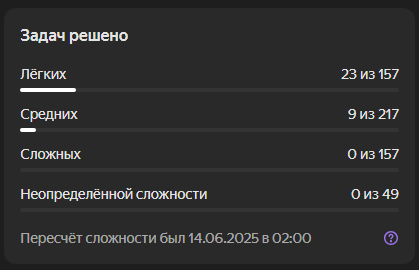

# Algo notes and CodeRun solutions

**Репозиторий с решениями задач на CodeRun и заметками по алгоритмам и структурам данных.**

---

## Описание
В этом репозитории собраны:  
— **Решения задач:** с онлайн-платформы [CodeRun](https://coderun.yandex.ru) (папка `code/solutions`)  
— **Заметки** по алгоритмам и структурам данных (папка `notes`)  
— **Шаблоны и структуры кода** по теме (папка `code/algos`, файл `code/data_structures.py`)

Цель проекта — решить 100 задач на CodeRun, разобраться в основных алгоритмах и структурах данных

## Структура репозитория
```text
/
├── code/
│   ├── algos/               # Шаблоны алгоритмов
│   ├── solutions/           # Готовые решения задач CodeRun
│   └── data_structures.py   # Реализация основных структур данных
├── notes/
│   ├── data_structures.md   # Теория по структурам данных
│   └── algos.md             # Теория по алгоритмам
├── src/
│   └── images/              # Иллюстрации
└── README.md                # Этот файл
```
### Быстро перейти
— [`Cтруктуры данных (data_structures)`](notes/data_structures.md)   
— [`Алгоритмы (algos)`](notes/algos.md)  
— [`Решение задач на CodeRun (solutions)`](code/solutions)

## Статистика по решению задач на CodeRun

